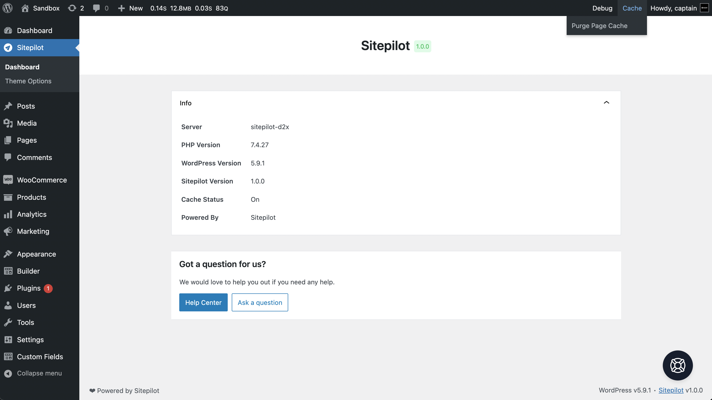

# Sitepilot

Brings the powers of Sitepilot directly to your WordPress website. It will revolutionize the way you use, manage and develop WordPress sites. This plugin is optimized for use on the [Sitepilot](https://sitepilot.io) managed WordPress hosting platform but should also work on other platforms.

[🚀 Download the latest release here.](https://github.com/sitepilot/sitepilot-plugin/releases)



## Plugin & Theme Development

This plugin implements the Laravel 8 [service container](https://laravel.com/docs/8.x/container). The service container is a powerful tool for managing class dependencies and performing dependency injection. Dependency injection is a fancy phrase that essentially means this: class dependencies are "injected" into the class via the constructor or, in some cases, "setter" methods.

You can use this container in your plugin or theme development workflow by creating a new [Application](./framework/Foundation/Application.php) instance and registering [Service Providers](https://laravel.com/docs/8.x/providers).

```php
use Sitepilot\Framework\Foundation\Application;

new Application('<namespace>', __FILE__, [
    \Sitepilot\Plugin\Providers\BrandingServiceProvider::class,
]);
```

A full example of how to implement the service container in your plugin  can be found in [sitepilot.php](./sitepilot.php) and the [app](./app) folder of this plugin. An example of the implementation in a theme can be found [here](https://github.com/sitepilot/theme).

### Namespace

Each application runs in its own unique namespace to prevent conflicts with other registered applications. The namespace is a required parameter of the class constructor and must be the same as the theme or plugin name.

### Service Providers

Service providers are the central place of all application bootstrapping. Your own plugin or theme, as well as all of Sitepilot's core services, are bootstrapped via service providers.

All service providers extend the `Sitepilot\Framework\Support\ServiceProvider` class. Most service providers contain a register and a boot method. Within the register method, you should only bind things into the service container. You should never attempt to register any other piece of functionality within the register method. Otherwise, you may accidentally use a service that is provided by a service provider which has not loaded yet.

#### The register method

Let's take a look at a basic service provider. Within any of your service provider methods, you always have access to the `$app` property which provides access to the service container:

```php 
namespace Sitepilot\Plugin\Branding;

use Sitepilot\Plugin\Services\BrandingService;
use Sitepilot\Framework\Support\ServiceProvider;

class BrandingServiceProvider extends ServiceProvider
{
    /**
     * Register application services.
     */
    public function register(): void
    {
        $this->app->alias(BrandingService::class, 'branding');
    }
}
```

This service provider only defines a `register` method, and uses that method to define an alias for Sitepilot\Plugin\Services\BrandingService in the service container. Now you can access this service using the `branding` property on the application instance. If you're not familiar with Laravel's service container, check out its [documentation](https://laravel.com/docs/8.x/providers).

#### The boot method

So, what if we need to register WordPress hooks, filters and shortcodes within our service provider? This should be done within the boot method. This method is called after all other service providers have been registered, meaning you have access to all other services that have been registered by the framework. You may type-hint dependencies for your service provider's boot method. The service container will automatically inject any dependencies you need.

```php
namespace Sitepilot\Plugin\Providers;

use Sitepilot\Plugin\Services\BrandingService;
use Sitepilot\Framework\Support\ServiceProvider;

class BrandingServiceProvider extends ServiceProvider
{
    /**
     * The branding service instance.
     */
    protected BrandingService $branding;

    /**
     * Bootstrap application services and hooks.
     */
    public function boot(BrandingService $branding): void
    {
        $this->branding = $branding;

        if ($branding->enabled()) {
            $this->add_filter_value('admin_footer_text', "❤ Powered by {$branding->powered_by()}");
            $this->add_filter_value('login_headerurl', $branding->website());
        }

        $this->add_shortcode('copyright', 'copyright_shortcode');
    }

    /**
     * Copyright shortcode.
     */
    public function copyright_shortcode($atts): string
    {
        $atts = shortcode_atts([
            'separator' => '&middot;',
            'text' => 'Powered by'
        ], $atts);

        return sprintf('&copy; %s %s %s %s <a href="%s" target="_blank">%s</a>', get_bloginfo('name'), date('Y'), $atts['separator'], $atts['text'], $this->branding->website(), $this->branding->powered_by());
    }
}
```
